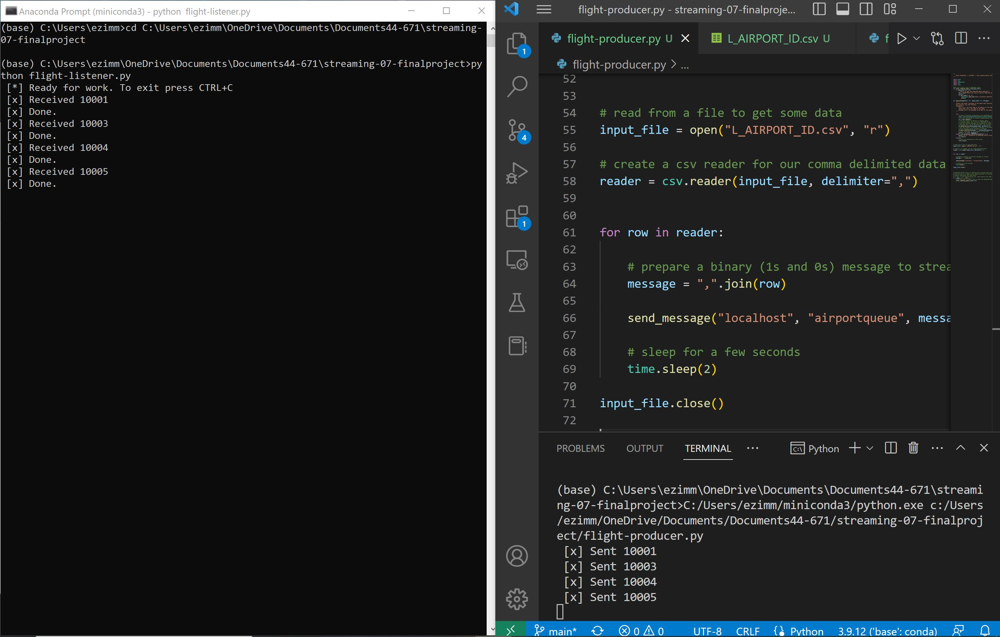

# streaming-07-finalproject

These two files take in flight codes and send them through the RabbitMQ server. This is useful to be sure that flights are happening when they should. 

Run the producer file and then the consumer file!

Here is the citation to my original data from Kaggle: https://www.kaggle.com/datasets/freddejn/flights?resource=download 

# Here is a photo of the consumer and producer running:
